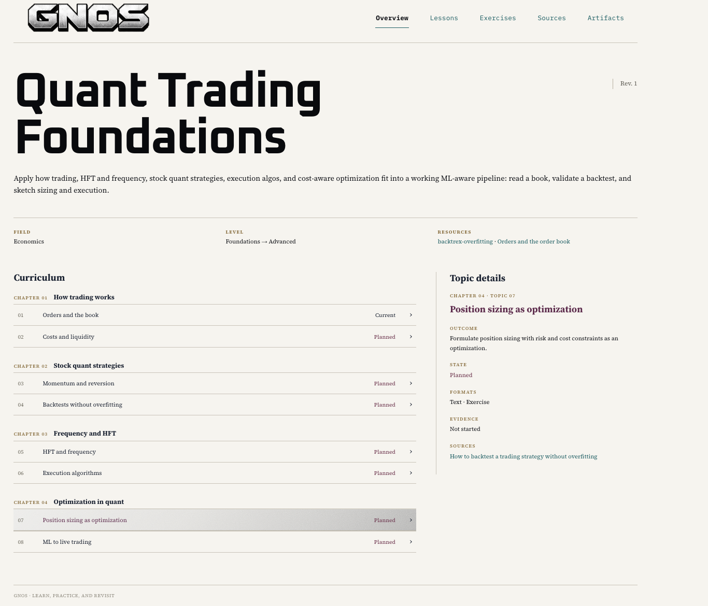

<p align="center">
  
</p>

<p align="center">
  <strong>Turn your coding agent into a teacher that builds a course around you.</strong>
</p>

<p align="center">
  <a href="https://github.com/madhvantyagi/Gnos/stargazers"></a>
  &nbsp;·&nbsp;
  <a href=".codex-plugin/plugin.json">Codex plugin</a>
  &nbsp;·&nbsp;
  <a href=".claude-plugin/plugin.json">Claude Code plugin</a>
  &nbsp;·&nbsp;
  <a href="LICENSE">MIT license</a>
</p>

## What is GNOS?

GNOS is a teaching harness made of skills, scripts, and visual tools. Tell it what you want to learn and how deep you want to go. It uses course materials such as university syllabi, textbooks, and documentation to plan a route, then teaches the next useful lesson.

As you work, GNOS records what you tried, where your reasoning broke, and what you could do independently. It uses that evidence to adjust upcoming lessons and exercises. The course grows with you.

## Study your course in a browser

Just ask GNOS to show your course in the browser. It routes the request to the `course-viewer` skill, which renders the curriculum and current lesson as a study page. Open a topic to read its lesson, work through exercises, and follow its sources and learning materials.

<p align="center">
  
</p>

<p align="center"><em>Browse the curriculum and open a topic to study it in the course viewer.</em></p>

## Why does learning with AI still feel hard?

Frontier models know a great deal, but a good answer is only one part of teaching. Learning a large subject also takes a coherent route, a diagnosis of mistakes, and a way to make abstract ideas visible. GNOS gives a coding agent that structure.

| The problem | What GNOS does |
| --- | --- |
| **The voice feels generic** | Subject-specific teachers use `SOUL.md` files to guide their explanations and judgment. This builds on my earlier [SOUL.md project](https://github.com/madhvantyagi/SOUL.md). |
| **Lessons lose the thread** | A living course plan and learner records keep topics, prior attempts, and the next step together across sessions. |
| **A correct answer gets mistaken for understanding** | Learner tracking distinguishes seeing an explanation, solving with help, and solving independently; the next exercise responds to the evidence. |
| **Everything becomes text** | GNOS can choose diagrams, images, simulations, narrated animations, or PDF handouts when that format helps explain the idea. Visual tools and media dependencies vary by environment. |

## Get started

### Use GNOS as a plugin

1. **Codex:** Install the [Codex plugin](.codex-plugin/plugin.json) from this repo's marketplace:

   ```sh
   codex plugin marketplace add madhvantyagi/Gnos --ref codex
   codex plugin add gnos@gnos
   ```

   Start a new Codex task and ask it to teach you a topic.

2. **Claude Code:** From the cloned repository root, load the [Claude Code plugin](.claude-plugin/plugin.json) for the session:

   ```sh
   claude --plugin-dir .
   ```

   In Claude Code, invoke `/gnos:learning-orchestrator`, then tell it what you want to learn. See the [Claude Code plugin guide](https://code.claude.com/docs/en/plugins) for other installation options.

### Use GNOS with another agent

For another agent that can read local files, clone the repo, open it as your workspace, and start with:

> Read `AGENTS.md`, then `skills/learning-orchestrator/SKILL.md`. Help me learn [topic].

For a longer course, tell GNOS your goal, starting point, desired depth, and how much time you have. For a single question, just ask it. [See the teaching entry point](skills/learning-orchestrator/SKILL.md).

## Help it grow

There is room for better visuals, transcription and spoken lessons, more subjects, and stronger ways to measure learning. If you use AI to teach yourself difficult things, try GNOS and [share what worked or broke](https://github.com/madhvantyagi/Gnos/issues). Contributions are welcome.

Built by a self-learner, for self-learners. If it helps you learn something hard, [star the repo](https://github.com/madhvantyagi/Gnos/stargazers) so others can find it.
