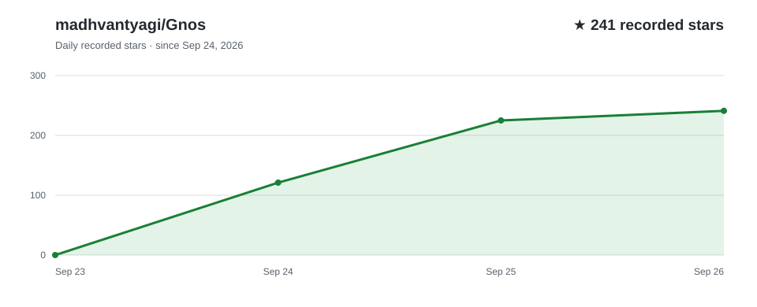

<p align="center">
  
</p>

<p align="center">
  <strong>Turn your coding agent into a teacher that builds a course around you.</strong>
</p>

<p align="center">
  <a href="https://github.com/madhvantyagi/Gnos/stargazers"></a>
  &nbsp;·&nbsp;
  <a href=".codex-plugin/plugin.json">Codex plugin</a>
  &nbsp;·&nbsp;
  <a href=".claude-plugin/plugin.json">Claude Code plugin</a>
  &nbsp;·&nbsp;
  <a href="LICENSE">MIT license</a>
</p>

## What is GNOS?

GNOS is a teaching harness made of skills, scripts, and visual tools. Tell it what you want to learn. For a course, it asks how deep you want to go and how much time you have, uses course materials such as university syllabi, textbooks, and documentation to plan a route, then builds the first lesson. Subagents make its lesson blocks; GNOS reviews and joins them before asking if you want to see the course.

As you work, GNOS records what you tried, where your reasoning broke, and what you could do independently. It uses that evidence to adjust upcoming lessons and exercises. The course grows with you.

## Star history

<p align="center">
  <a href="https://github.com/madhvantyagi/Gnos/stargazers">
    
  </a>
</p>

## Study your course in a browser

Just ask GNOS to show your course in the browser. It routes the request to the `course-viewer` skill, which renders the curriculum and current lesson as a study page. Open a topic to read its lesson, work through exercises, and follow its sources and learning materials.

<p align="center">
  
</p>

<p align="center"><em>Browse the curriculum and open a topic to study it in the course viewer.</em></p>

A true slideshow can't run inside a README, so here is the closest thing — click each frame to expand it:

<details>
<summary><strong>Frame 1 · Simulation</strong> — run route policies on the building grid</summary>
<br />
<p align="center">
  
</p>
</details>

<details>
<summary><strong>Frame 2 · Lesson video</strong> — watch a narrated lesson block</summary>
<br />
<p align="center">
  
</p>
</details>

## Why does learning with AI still feel hard?

Frontier models know a great deal, but a good answer is only one part of teaching. Learning a large subject also takes a coherent route, a diagnosis of mistakes, and a way to make abstract ideas visible. GNOS gives a coding agent that structure.

| The problem | What GNOS does |
| --- | --- |
| **The voice feels generic** | Subject-specific teachers use `SOUL.md` files to guide their explanations and judgment. This builds on my earlier [SOUL.md project](https://github.com/madhvantyagi/SOUL.md). |
| **Lessons lose the thread** | A living course plan and learner records keep topics, prior attempts, and the next step together across sessions. |
| **A correct answer gets mistaken for understanding** | Learner tracking distinguishes seeing an explanation, solving with help, and solving independently; the next exercise responds to the evidence. |
| **Everything becomes text** | GNOS can choose diagrams, images, simulations, narrated animations, or PDF handouts when that format helps explain the idea. Visual tools and media dependencies vary by environment. |

## Get started

Start with Git, Python 3, and your preferred coding agent installed. Clone GNOS once and use this folder as your learning workspace:

```sh
git clone https://github.com/madhvantyagi/Gnos.git
cd Gnos
```

### Codex

Install the [plugin](https://developers.openai.com/codex/plugins/) through the Codex CLI:

```sh
codex plugin marketplace add madhvantyagi/Gnos --ref main
codex plugin add gnos@gnos
```

Start a new Codex session in `Gnos`, or open the folder in the Codex app and start a new task. Ask:

> Use GNOS. Read `skills/learning-orchestrator/SKILL.md` in this workspace and teach me [topic].

### Claude Code

From `Gnos`, launch Claude Code with the plugin:

```sh
claude --plugin-dir .
```

Enter `/gnos:learning-orchestrator Teach me [topic]`. Repeat the launch command each session; [`--plugin-dir` is session-only](https://code.claude.com/docs/en/plugins/create#load-a-plugin-for-one-session).

### OpenCode, Antigravity, and other agents

Open the `Gnos` folder as your workspace. For **OpenCode**, run `opencode` from that folder; for **Antigravity**, open it in the editor. Send:

```text
Read AGENTS.md, then skills/learning-orchestrator/SKILL.md.
Use GNOS to teach me [topic]. Keep courses and progress in this workspace.
```

This uses GNOS directly from its files; your agent needs local file and terminal access. [OpenCode also loads `AGENTS.md` automatically](https://opencode.ai/docs/rules/). Keep the repository together so its teachers, references, and scripts remain available.

**Visual tools:** Codex and Claude Code load the server definitions in [`.mcp.json`](.mcp.json). For [OpenCode](https://opencode.ai/docs/mcp-servers/) or [Antigravity](https://antigravity.google/docs/mcp), configure those servers using the host's MCP format. Pinepaper needs Node.js/npm; image generation uses your agent's available tools, while PDF and video lessons need their own dependencies.

For a course, share your goal, starting point, depth, and available time. To study the result, ask: **“Show my course in the browser.”**

## Help it grow

GNOS grows through its users. If it helps you learn something hard, [share what worked or broke](https://github.com/madhvantyagi/Gnos/issues) and [star the repo](https://github.com/madhvantyagi/Gnos/stargazers) so others can find it.
