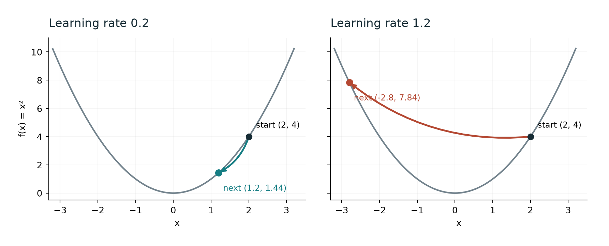

# Why subtract the gradient?

A short GNOS lesson with Ben Waston and Theo Park. Goal: explain one update,
then recognize why a larger step can fail.

## Begin with one variable

For f(x)=x², start at x=2. The slope there is 4. A small positive change in x
increases f; a small negative change decreases it. Subtracting a positive
multiple of the slope therefore moves locally in the decreasing direction.

```math
x_{next}=x-\eta f'(x)
```

The derivative chooses a local direction and scale. The learning rate, eta,
controls how much of that proposed change we take. The word “local” matters.



## Work through the numbers

At x=2, f(x)=4 and f'(x)=4. Compare two learning rates using exactly the same
starting point and derivative.

| Learning rate | Next x | Next loss | Result |
| --- | --- | --- | --- |
| 0.2 | 1.2 | 1.44 | Loss falls |
| 1.2 | -2.8 | 7.84 | Loss rises |

The second update used the correct local direction. Its step was too large
for that local information to remain useful over the whole move.

## Now let two coordinates change

For L(x,y)=x²+2y², the gradient collects the two partial derivatives:

```math
\nabla L(x,y)=(2x,4y)
```

At (1,1), that is (2,4). A learning rate of 0.1 gives the new point (0.8,0.6).
The loss falls from 3 to 1.36. Compute both new coordinates from the old point.

```python
def step(x, y, eta):
    gx, gy = 2*x, 4*y
    return x - eta*gx, y - eta*gy
```

## Try a changed case

- For f(x)=x², start at x=-2 with learning rate 0.2. Predict the direction before calculating.
- For L(x,y)=x²+2y², explain why the same step size can behave differently along the two axes.

If the second question is unclear, compare the multipliers in the updates:
x becomes (1−2η)x, while y becomes (1−4η)y. The y coordinate has the steeper
curvature, so its stable step-size range is narrower.

## Further reading

[MIT 6.390: Gradient Descent, sections 3.1 and 3.2](https://introml.mit.edu/notes/gradient_descent.html)

This is a demonstration handout. Reading it alone is not recorded as proof of
understanding. The figure is an original model illustration, not measured data.
